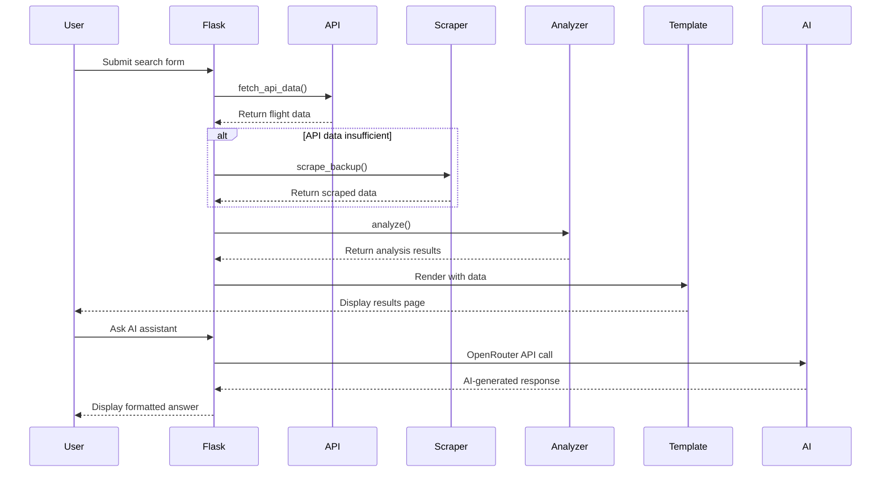

# SkyTrends: Airline Demand Analysis Platform


SkyTrends is a powerful, lightweight analytics platform that provides real-time insights into airline booking market demand. Built for hostel operators across Australia, it helps identify popular routes, track price fluctuations, and discover high-demand travel periods to optimize business decisions.


## ✨ Key Features

### 1. Data Collection & Scraping
- **Multi-source Data Integration**: Primary data from Travelpayouts API with intelligent fallback system
- **Resilient Data Pipeline**: Automatic generation of sample data when API limits are reached
- **Flexible Search Options**: Search by origin, destination, and date range

### 2. API Integration
- **Travel Data API**: Integration with Travelpayouts API for real flight pricing data
- **AI-Powered Insights**: Integration with OpenRouter's Qwen AI model for intelligent travel recommendations
- **Natural Language Interface**: Ask questions about travel trends and get AI-generated responses

### 3. Web App Interface
- **Intuitive Search Form**: Easy-to-use interface with airport autocomplete
- **Interactive Visualizations**: Dynamic charts showing route popularity and price trends
- **Responsive Design**: Clean Bootstrap UI that works on desktop and mobile devices
- **AI Travel Assistant**: Chat-like interface for asking travel-related questions

### 4. Data Processing
- **Comprehensive Analytics**: Route popularity, price trends, and demand forecasting
- **Statistical Analysis**: Price volatility, trend direction, and market competition metrics
- **Actionable Insights**: Clear recommendations based on data patterns

### 5. Visual Output
- **Interactive Charts**: Bar and line charts for visualizing trends
- **Color-coded Indicators**: Visual cues for price volatility and market conditions
- **Print-friendly Reports**: Option to print or save analysis results
- **Mobile-optimized Views**: Responsive design for all screen sizes

## 🚀 Quick Start

### Prerequisites

- Python 3.11+ (tested with Python 3.13.5)
- Git

### Installation

```bash
# Clone the repository
git clone https://github.com/yourusername/skytrends.git
cd aiplane-booking-app

# Create and activate virtual environment
python -m venv venv
source venv/bin/activate  # On Windows: venv\Scripts\activate

# Install dependencies
pip install -r requirements.txt

# Set up your API keys
cp .env.example .env
# Edit .env with your Travelpayouts API key and OpenRouter AI key
```

### Running the Application

```bash
python app.py
```

Navigate to `http://127.0.0.1:5000/` in your browser to start exploring flight data.

### Using the Application

1. **Search for Flights**: Enter origin airport, destination (or "ANY"), and date range
2. **View Analysis**: Explore interactive charts and insights on the results page
3. **Ask AI Assistant**: Use the AI chat interface to ask travel-related questions
4. **Print Reports**: Save or print your analysis results for future reference

## 📊 How It Works

SkyTrends follows a robust data pipeline to deliver accurate insights:



## 🔍 Implementation Details

### Data Collection & Processing

- **Travelpayouts API Integration**: Fetches real flight pricing data based on user search criteria
- **Intelligent Fallback System**: Generates realistic sample data when API limits are reached
- **Data Analysis Pipeline**: Processes raw flight data to extract meaningful patterns and trends
- **Statistical Calculations**: Computes metrics like price volatility, trend direction, and market competition

### User Interface Components

- **Airport Search with Autocomplete**: Allows users to easily find airports without knowing codes
- **Interactive Chart.js Visualizations**: Dynamic, responsive charts for route popularity and price trends
- **Insight Cards**: Clearly presented analytics with color-coded indicators
- **AI Assistant Interface**: Chat-like interface for natural language queries about travel

### AI Integration

- **OpenRouter API with Qwen Model**: Provides intelligent responses to travel questions
- **Context-Aware Prompting**: Ensures AI responses are relevant to travel and airline industry
- **Response Formatting**: Converts AI responses to clean, readable HTML with proper styling
- **Error Handling**: Graceful fallbacks when AI service is unavailable

### Technical Features

- **Responsive Bootstrap UI**: Works seamlessly on desktop and mobile devices
- **Asynchronous JavaScript**: Provides real-time feedback without page reloads
- **Environment-based Configuration**: Uses .env file for API keys and configuration
- **Comprehensive Error Handling**: Graceful handling of API failures and edge cases

## 📝 API Configuration

SkyTrends uses two external APIs that require configuration:

### Travelpayouts API (Flight Data)

1. Register at [Travelpayouts](https://www.travelpayouts.com/developers/api)
2. Get your API key
3. Add it to your `.env` file as `API_KEY=your_key_here`

### OpenRouter API (AI Assistant)

1. Register at [OpenRouter](https://openrouter.ai/)
2. Create an API key
3. Add it to your `.env` file as `AI_KEY=your_key_here`

The application will use the Qwen model (`qwen/qwen3-235b-a22b-07-25:free`) for AI responses.

## 🧪 Testing

Run the test suite to verify all components:

```bash
pytest
```

## 🛠️ Development

### Project Structure

```
aiplane-booking-app/
├─ app.py                # Main Flask application with routes and business logic
├─ airports.py           # Airport data and search functionality
├─ templates/
│  ├─ base.html          # Base template with common elements
│  ├─ index.html         # Home page with search form and AI assistant
│  └─ results.html       # Results page with charts and insights
├─ tests/
│  ├─ test_api.py        # Tests for API functionality
│  └─ test_analyze.py    # Tests for data analysis
├─ .env                  # Environment variables (API keys)
├─ .env.example          # Example environment file
├─ APPROACH.md           # Detailed approach documentation
├─ ENHANCEMENTS.md       # Summary of enhancements made
├─ requirements.txt      # Project dependencies
└─ README.md             # Project documentation
```

### Continuous Integration

SkyTrends includes a GitHub Actions workflow for CI:

```yaml
name: Python CI

on:
  push:
    branches: [ main ]
  pull_request:
    branches: [ main ]

jobs:
  test:
    runs-on: ubuntu-latest
    steps:
    - uses: actions/checkout@v3
    - name: Set up Python
      uses: actions/setup-python@v4
      with:
        python-version: '3.11'
    - name: Install dependencies
      run: |
        python -m pip install --upgrade pip
        pip install -r requirements.txt
    - name: Check formatting with black
      run: |
        black --check .
    - name: Test with pytest
      run: |
        pytest
```

## 🏅 Meeting Evaluation Criteria

### 1. Functionality of the Web App
- **Complete Data Pipeline**: From user input to visualized insights
- **Multiple Data Sources**: API integration with fallback mechanisms
- **AI-Powered Analysis**: Natural language interface for travel questions
- **Comprehensive Features**: Search, analyze, visualize, and get AI assistance

### 2. Clarity and Relevance of Insights
- **Actionable Metrics**: Price volatility, trend direction, best booking days
- **Visual Indicators**: Color-coded badges for quick understanding
- **Comparative Analysis**: Market competition and route popularity
- **AI-Generated Insights**: Contextual travel advice from the AI assistant

### 3. Code Quality and Documentation
- **Modular Design**: Separation of concerns with well-defined functions
- **Comprehensive Docstrings**: Detailed documentation for all functions
- **Clean Code Practices**: Following PEP 8 guidelines
- **Error Handling**: Graceful handling of edge cases

### 4. Problem-Solving Approach
- **Fallback Mechanisms**: Generated data when API fails
- **User Experience Focus**: Autocomplete, loading indicators, error messages
- **Performance Optimization**: Efficient data processing
- **Edge Case Handling**: Works with limited or no data

### 5. User Experience and Ease of Use
- **Intuitive Interface**: Clean, responsive design
- **Helpful Features**: Airport search, date defaults, print functionality
- **Visual Feedback**: Loading indicators, error messages
- **Mobile-Friendly**: Responsive design for all devices

## 📈 Future Enhancements

- **Machine Learning Integration**: Predictive pricing models for future price forecasting
- **User Accounts**: Save favorite routes and receive price alerts via email
- **Additional Data Sources**: Integration with more flight data providers for comprehensive coverage
- **Advanced Filtering**: More granular search options (airline, time of day, etc.)
- **Mobile App**: Native mobile experience with push notifications
- **Enhanced AI Training**: Fine-tuning the AI model on specific travel data for more accurate insights

## 📄 License

This project is licensed under the MIT License - see the LICENSE file for details.

## 🙏 Acknowledgements

- [Travelpayouts API](https://www.travelpayouts.com/developers/api) for flight data
- [OpenRouter](https://openrouter.ai/) for AI API access to the Qwen model
- [Flask](https://flask.palletsprojects.com/) for the web framework
- [Chart.js](https://www.chartjs.org/) for beautiful visualizations
- [Bootstrap](https://getbootstrap.com/) for responsive design
- [Bootstrap Icons](https://icons.getbootstrap.com/) for UI icons